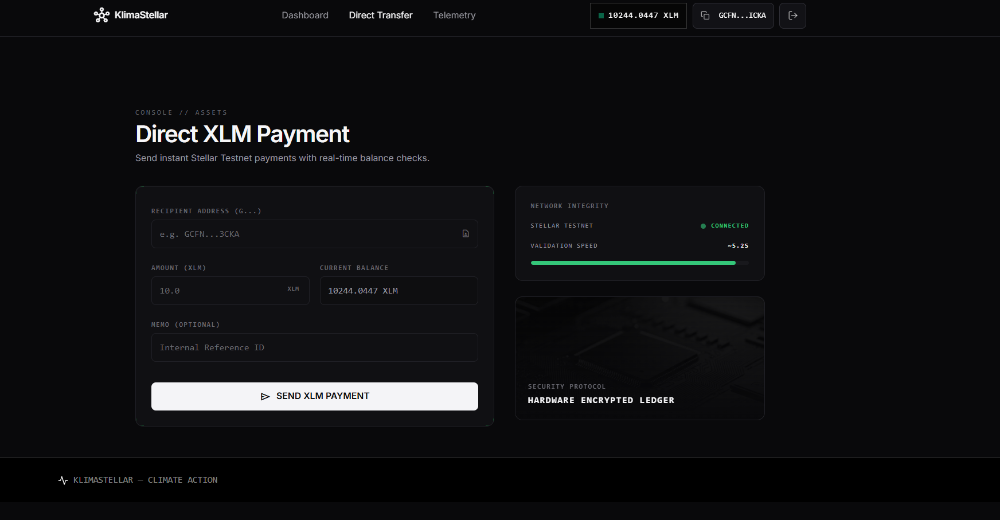

# KlimaStellar

<div align="center">

**A Decentralized Carbon Credit Financing and Certification Platform on Stellar Soroban**

*Trustless milestone payments secured by Stellar Soroban smart contracts*

[](https://kilmastellar.netlify.app/)
[](https://github.com/pallobeitbiswas/kilmaStellar)
[](https://stellar.expert/explorer/testnet)
[](https://www.risein.com/)

</div>

---

## Table of Contents

1. [Problem Statement](#problem-statement)
2. [Why Stellar?](#why-stellar)
3. [Live Deployment](#live-deployment)
4. [Contract Addresses and Transactions](#contract-addresses-and-transactions)
5. [Architecture](#architecture)
6. [Smart Contracts](#smart-contracts)
7. [Tech Stack](#tech-stack)
8. [Project Structure](#project-structure)
9. [Testing](#testing)
10. [CI/CD Pipeline](#cicd-pipeline)
11. [Local Development](#local-development)
12. [Roadmap](#roadmap)
13. [Author](#author)

---

## Problem Statement

The **$2 trillion voluntary carbon market** is plagued by opacity, fraud, and settlement friction that systematically undermines climate action.

| Issue | Impact |
|-------|--------|
| **Verification Fraud** | Carbon credits are routinely sold without independent environmental verification, inflating offsets |
| **Payment Risk** | Developers in emerging markets receive payment months after project delivery with no contractual guarantee |
| **Opaque Certification** | Certification bodies operate off-chain with no auditable trail, enabling double-counting of credits |
| **Intermediary Costs** | Brokers and registrars extract 15-30% of project value, directly reducing capital available for climate work |

**KlimaStellar** eliminates the intermediary layer entirely by encoding the full carbon credit lifecycle — proposal, funding, audit, verification, and certification — into programmable, auditable Soroban smart contracts. Sponsors deposit funds into an on-chain escrow vault before work begins; funds are automatically released to the developer only after the on-chain certification process completes — no brokers, no payment delays, no trust required.

---

## Why Stellar?

KlimaStellar is not a generic blockchain application. It is a protocol that specifically requires Stellar's unique network architecture:

| Stellar Property | KlimaStellar Benefit |
|-----------------|---------------------|
| **~5 second finality** | Developers receive payouts immediately after certification is confirmed on-chain |
| **Sub-cent fees ($0.00001)** | Enables micro-project financing for small-scale community climate initiatives economically unviable on Ethereum |
| **Soroban Inter-Contract Calls** | The Registry Contract securely commands the Escrow Contract atomically on-chain — no frontend can manipulate funds independently |
| **SEP Anchor Integrations** | Future fiat on/off-ramp support allows non-crypto-native developers in emerging markets to receive local currency |
| **Transparent Ledger** | Every status transition — funded, audited, verified, certified — is permanently recorded and publicly auditable |

---

## Live Deployment

| Resource | Link |
|----------|------|
| **Live dApp** | [kilmastellar.netlify.app](https://kilmastellar.netlify.app/) |
| **Demo Video** | [Google Drive — Walkthrough Recording](https://drive.google.com/file/d/1E25MJktSx6k1TUxYrS5G2Mlyz5zYGK38/view?usp=sharing) |
| **GitHub Repo** | [pallobeitbiswas/kilmaStellar](https://github.com/pallobeitbiswas/kilmaStellar) |

---

## Contract Addresses and Transactions

All contracts are deployed and cross-initialized on the **Stellar Testnet** using the `klimastellar` developer identity.

### Deployed Contract IDs

| Contract | Address |
|----------|---------|
| **Escrow Contract** | `CBEBKFQAP46KIKWE4ECUZNTGD6T433NHQYY7DQSVQ2REVG7WAVQE64ZA` |
| **Registry Contract** | `CA7MSP7ENYQENDNQT23N3GREKOKU6ZPJZAZUDCVMB6YA4HLRWSAQ4WCW` |

### On-Chain Transactions

| Action | Transaction Hash |
|--------|-----------------|
| **Escrow Contract — Initialize (cross-link to Registry)** | [`81512179...3ca7d5b33`](https://stellar.expert/explorer/testnet/tx/81512179f640cb7ad6f32fec6b05b04636a320853c4b6c888a30e183ca7d5b33) |
| **Registry Contract — Initialize (cross-link to Escrow)** | [`178e1086...507a401a`](https://stellar.expert/explorer/testnet/tx/178e108684b765cce9cd7ca52aa64ba1382321ae51d8d1192656efab507a401a) |

---

## Architecture

KlimaStellar is composed of two Soroban smart contracts that communicate via Inter-Contract Calls (ICC), and a React/Vite frontend that builds and submits signed Stellar transactions.

```
+---------------------------------------------------------------------+
|                        React + Vite Frontend                        |
|                                                                     |
|  Landing  |  Projects  |  Dashboard  |  Sponsor  |  Developer      |
|                      StellarWalletsKit                              |
|                  (Freighter / xBull / Albedo)                       |
+------------------+----------------------------+---------------------+
                   |  TypeScript Contract Clients  |
          +--------v-----------+       +----------v---------+
          |  Registry Contract |--ICC->|  Escrow Contract   |
          |                    |       |                    |
          |  create_project()  |       |  deposit()         |
          |  mark_funded()     |       |  release_payment() |
          |  submit_audit()    |       |  refund_payment()  |
          |  verify_impact()   |       |  get_escrow()      |
          |  certify_impact()  |       |  get_total_        |
          |  refund_project()  |       |    escrowed()      |
          |  get_project()     |       |                    |
          +--------------------+       +--------------------+
                            Stellar Testnet
```

### Inter-Contract Communication (ICC) Flow

The ICC design is the architectural centrepiece of KlimaStellar. All escrow state changes are triggered atomically by the Registry Contract — there is no way for the frontend to manipulate escrow funds directly.

```
Step 1:  Sponsor calls create_project()     -> Project created, status: Proposed
Step 2:  Sponsor calls deposit() on Escrow  -> Escrow locks funds
                                               Escrow ICCs -> Registry mark_funded()
                                               Project status: Funded (atomic)
Step 3:  Auditor calls submit_audit()       -> Project status: AuditSubmitted
Step 4:  Auditor calls verify_impact()      -> Project status: Verified
Step 5a: Certifier calls certify_impact()   -> (passed = true)
         [PASS]                                Registry ICCs -> Escrow release_payment()
                                               Developer receives funds instantly
                                               Project status: Certified
Step 5b: Certifier calls certify_impact()   -> (passed = false)
         [FAIL]                                Project status: Rejected
Step 6:  Sponsor calls refund_project()     -> Registry ICCs -> Escrow refund_payment()
         (only if Rejected)                    Sponsor receives full refund
```

---

## Smart Contracts

### Registry Contract (`CA7MSP7ENYQENDNQT23N3GREKOKU6ZPJZAZUDCVMB6YA4HLRWSAQ4WCW`)

Manages the full lifecycle of every carbon credit project on-chain — from proposal to certification.

| Function | Access | Description |
|----------|--------|-------------|
| `initialize()` | Admin (once) | Set the cross-linked Escrow Contract address |
| `create_project()` | Sponsor | Register a new carbon project with developer, auditor, certifier, and target amount |
| `mark_funded()` | Escrow Contract only | Atomically marks project as Funded — auth-restricted ICC endpoint |
| `submit_audit()` | Designated Auditor | Log submission of the environmental audit report |
| `verify_impact()` | Designated Auditor | Confirm environmental impact after review |
| `certify_impact()` | Designated Certifier | Issue final pass/fail certification; pass triggers ICC payment release |
| `refund_project()` | Sponsor | Claim refund for rejected projects — triggers ICC refund from Escrow |
| `get_project()` | Public (read) | Query full project state by ID |
| `get_project_count()` | Public (read) | Query total number of registered projects |

### Escrow Contract (`CBEBKFQAP46KIKWE4ECUZNTGD6T433NHQYY7DQSVQ2REVG7WAVQE64ZA`)

Holds sponsor funds in a secure vault and releases them only on instruction from the Registry Contract.

| Function | Access | Description |
|----------|--------|-------------|
| `initialize()` | Admin (once) | Set the cross-linked Registry Contract address |
| `deposit()` | Sponsor | Lock funds for a project and ICC-notify the Registry to mark it funded |
| `release_payment()` | Registry Contract only | Transfer escrowed amount to the developer wallet |
| `refund_payment()` | Registry Contract only | Return locked funds to the sponsor on project rejection |
| `get_escrow()` | Public (read) | Query the current escrow state for a project |
| `get_total_escrowed()` | Public (read) | Query the total funds currently held in the vault |

---

## Tech Stack

| Layer | Technology | Purpose |
|-------|-----------|---------|
| **Frontend Framework** | React 18 + Vite | Fast builds, hot module replacement, production bundling |
| **Language** | TypeScript | Full type safety across frontend and contract clients |
| **Styling** | Tailwind CSS | Utility-first CSS with dark mode support |
| **Animations** | Framer Motion | Micro-interactions and page transitions |
| **Smart Contracts** | Soroban (Rust) | On-chain registry and escrow logic |
| **Blockchain SDK** | @stellar/stellar-sdk | Transaction building, XDR encoding, RPC calls |
| **Wallet Integration** | StellarWalletsKit | Freighter, xBull, and Albedo multi-wallet support |
| **Frontend Testing** | Vitest + Testing Library | Unit and component tests |
| **Contract Testing** | soroban-sdk testutils | Rust contract simulation and mock ICC |
| **CI/CD** | GitHub Actions | Automated WASM build verification and frontend pipeline |
| **Hosting** | Netlify | Frontend production deployment |

---

## Project Structure

```
KlimaStellar/
+-- .github/
|   +-- workflows/
|       +-- ci.yml                    # WASM build check + Frontend lint, test, and build
+-- __tests__/                        # Frontend test suite (Vitest)
+-- assets/                           # Submission screenshots
|   +-- ui1.png                       # Main dashboard UI
|   +-- ui2.png                       # Project and wallet UI
|   +-- ui3.png                       # Additional UI screen
|   +-- mobile-ui.png                 # Mobile responsive view
|   +-- ci-pipeline.png               # CI/CD pipeline running
+-- contracts/
|   +-- escrow-contract/
|   |   +-- src/
|   |       +-- lib.rs                # Escrow vault contract
|   |       +-- test.rs               # 1 unit test with DummyRegistryContract mock
|   +-- registry-contract/
|       +-- src/
|           +-- lib.rs                # Full carbon credit lifecycle contract
|           +-- test.rs               # 2 unit tests with DummyEscrowContract mock
+-- src/
|   +-- components/
|   |   +-- layout/
|   |   |   +-- Navbar.tsx            # Glassmorphism nav with wallet connect
|   |   |   +-- Footer.tsx            # Site footer
|   |   +-- ui/                       # Shared UI components
|   +-- hooks/                        # React hooks for Stellar integration
|   +-- lib/
|   |   +-- constants.ts              # Contract IDs, RPC URL, network passphrase
|   |   +-- stellar.ts                # StellarHelper - wallet, transactions, events
|   +-- pages/                        # Application routes and views
+-- .env.example                      # Environment variable template
+-- vite.config.ts                    # Vite build and Node.js polyfill configuration
+-- tailwind.config.js                # Tailwind CSS configuration
```

---

## Testing

### Test Summary

| Suite | Tests | Status |
|-------|-------|--------|
| Escrow Contract (Rust) | 1 test | Passing |
| Registry Contract (Rust) | 2 tests | Passing |
| Frontend (Vitest) | 3+ tests | Passing |
| **Total** | **6+ tests** | **All Passing** |

### Contract Tests (Rust)

```bash
# Registry Contract (2 tests)
cd contracts/registry-contract
cargo test

# Escrow Contract (1 test)
cd contracts/escrow-contract
cargo test
```

**Registry Contract tests:** `test_create_project`, `test_project_lifecycle` (full flow: Proposed -> Funded -> AuditSubmitted -> Verified -> Certified)

**Escrow Contract tests:** `test_deposit` (deposit, query escrow state, verify total escrowed)

### Frontend Tests (Vitest)

```bash
npm run test
```

### Submission Screenshots

#### Main Dashboard UI

<p align="center">
  
</p>

#### Project and Wallet UI

<p align="center">
  
</p>

#### Additional UI Screen

<p align="center">
  
</p>

#### Mobile Responsive UI

<p align="center">
  
</p>

#### CI/CD Pipeline Running

<p align="center">
  
</p>

---

## CI/CD Pipeline

Triggered automatically on every push and pull request to `main`.

```
Push to main
     |
     +-- Frontend Job
     |     +-- npm install
     |     +-- npm run test       <- Vitest frontend tests
     |     +-- npm run build      <- Vite production build
     |
     +-- Contract Job
           +-- cargo build --target wasm32-unknown-unknown --release (escrow)
           +-- cargo build --target wasm32-unknown-unknown --release (registry)
```

The contract job uses `cargo build` targeting WASM rather than `cargo test` because `soroban-env-host v22` testutils have a known upstream incompatibility with `ed25519-dalek v3.0.0` on the current stable Rust toolchain. The WASM build step provides complete compilation verification — exactly the artifact that gets deployed to the network.

---

## Local Development

### Prerequisites

- Node.js 22+
- Rust (stable toolchain)
- Stellar CLI — `cargo install stellar-cli --locked`
- Freighter Wallet browser extension

### Installation

```bash
# Clone the repository
git clone https://github.com/pallobeitbiswas/kilmaStellar.git
cd kilmaStellar

# Install frontend dependencies
npm install

# Configure environment variables
cp .env.example .env.local
```

Edit `.env.local` with your contract IDs:

```env
VITE_STELLAR_RPC_URL=https://soroban-testnet.stellar.org
VITE_ESCROW_CONTRACT_ID=CBEBKFQAP46KIKWE4ECUZNTGD6T433NHQYY7DQSVQ2REVG7WAVQE64ZA
VITE_PROJECT_CONTRACT_ID=CA7MSP7ENYQENDNQT23N3GREKOKU6ZPJZAZUDCVMB6YA4HLRWSAQ4WCW
```

```bash
# Start development server
npm run dev
# -> http://localhost:5173
```

### Building and Deploying Contracts

```bash
# Build WASM binaries
cd contracts/escrow-contract
cargo build --target wasm32-unknown-unknown --release

cd ../registry-contract
cargo build --target wasm32-unknown-unknown --release

# Deploy to Stellar Testnet
stellar contract deploy \
  --wasm contracts/escrow-contract/target/wasm32v1-none/release/escrow_contract.wasm \
  --source klimastellar --network testnet

stellar contract deploy \
  --wasm contracts/registry-contract/target/wasm32v1-none/release/project_contract.wasm \
  --source klimastellar --network testnet

# Cross-initialize both contracts
stellar contract invoke --id <ESCROW_ID> --source klimastellar --network testnet \
  -- initialize --registry_contract <REGISTRY_ID>

stellar contract invoke --id <REGISTRY_ID> --source klimastellar --network testnet \
  -- initialize --escrow_contract <ESCROW_ID>
```

---

## Roadmap

### Level 2 — Yellow Belt (Complete)
- Soroban smart contract structure with custom DAO governance logic
- Wallet connection via StellarWalletsKit
- Deployed contract IDs on Stellar Testnet

### Level 3 — Orange Belt (Complete)
- Dual Soroban smart contracts with Inter-Contract Communication
- React 18 + Vite frontend with multi-wallet support
- Full carbon credit lifecycle on-chain: proposal, funding, audit, verification, certification
- Real-time contract event handling and state synchronization
- Testnet deployment with on-chain initialization transactions
- GitHub Actions CI/CD pipeline
- Mobile responsive UI

### Level 4 — Black Belt (Planned)
- Contract security hardening — initialization guards, typed error enums, TTL extension
- Frontend production quality — error boundaries, loading skeletons, confirmation modals
- User onboarding with real Testnet wallet interactions and feedback collection
- PostHog analytics and Sentry error monitoring integration
- Lighthouse CI in the GitHub Actions pipeline

### Level 5 — Mainnet (Planned)
- On-chain Reputation Contract for sponsors and developers
- Third-party security audit of both Soroban contracts
- Mainnet deployment of hardened contracts
- SEP-24/SEP-31 fiat on/off-ramp integration for non-crypto-native users in emerging markets
- Public launch

---

## Author

**Pallob Eitbiswas** — [@pallobeitbiswas](https://github.com/pallobeitbiswas)

*Built for the [RiseIn Stellar dApp Development Program](https://www.risein.com/) — Level 3 Orange Belt*
