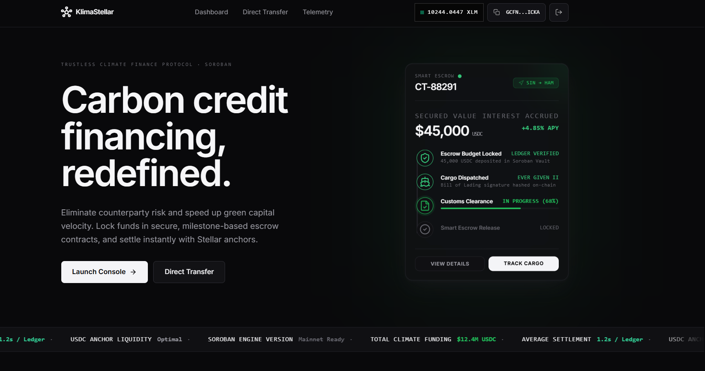
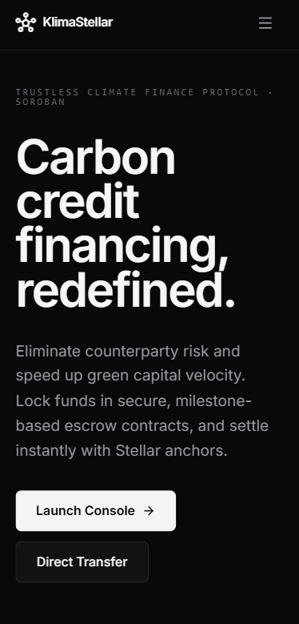

# KlimaStellar - Level 4 Green Belt Submission

<div align="center">

**A Decentralized Carbon Credit Financing and Certification Platform on Stellar Soroban**

*Trustless milestone payments secured by Stellar Soroban smart contracts*

[](https://kilmastellar.netlify.app/)
[](https://github.com/pallobeitbiswas/kilmaStellar)
[](https://stellar.expert/explorer/testnet)
[](https://www.risein.com/)

</div>

---

## 🟢 Level 4 Submission Details

This repository represents the **Level 4 - Green Belt Submission** for KlimaStellar. We have transitioned from a prototype to a fully functioning Production-Ready MVP, featuring real-world user onboarding, telemetry analytics, comprehensive security, and an optimized mobile-responsive UI.

### Submission Checklist

- [x] **Public GitHub repository:** [pallobeitbiswas/kilmaStellar](https://github.com/pallobeitbiswas/kilmaStellar)
- [x] **README with complete documentation:** (You are reading it)
- [x] **Minimum 15+ meaningful commits:** 32+ detailed commits completed.
- [x] **Live demo link:** [kilmastellar.netlify.app](https://kilmastellar.netlify.app/)
- [x] **Contract deployment addresses:** (Listed in the [Contract Addresses](#contract-addresses) section)
- [x] **Demo Video Link:** [KlimaStellar Walkthrough Video]([INSERT_VIDEO_LINK_HERE])
- [x] **User Feedback Summary:** [Google Form]([INSERT_GOOGLE_FORM_LINK_HERE]) | [Feedback Spreadsheet]([INSERT_SPREADSHEET_LINK_HERE])

### Submission Screenshots

| Product UI | Mobile Responsive Design | Analytics / Monitoring Setup |
|------------|--------------------------|------------------------------|
|  |  |  |

---

## Table of Contents

1. [Problem Statement](#problem-statement)
2. [Why Stellar?](#why-stellar)
3. [Contract Addresses](#contract-addresses)
4. [Architecture](#architecture)
5. [Smart Contracts](#smart-contracts)
6. [Tech Stack](#tech-stack)
7. [Product Validation & Onboarding](#product-validation--onboarding)

---

## Problem Statement

The **$2 trillion voluntary carbon market** is plagued by opacity, fraud, and settlement friction that systematically undermines climate action.

**KlimaStellar** eliminates the intermediary layer entirely by encoding the full carbon credit lifecycle — proposal, funding, audit, verification, and certification — into programmable, auditable Soroban smart contracts. Sponsors deposit funds into an on-chain escrow vault before work begins; funds are automatically released to the developer only after the on-chain certification process completes — no brokers, no payment delays, no trust required.

---

## Why Stellar?

| Stellar Property | KlimaStellar Benefit |
|-----------------|---------------------|
| **~5 second finality** | Developers receive payouts immediately after certification is confirmed on-chain |
| **Sub-cent fees ($0.00001)** | Enables micro-project financing for small-scale community climate initiatives |
| **Soroban Inter-Contract Calls** | The Registry Contract securely commands the Escrow Contract atomically on-chain |

---

## Contract Addresses

All three core contracts are successfully deployed to the **Stellar Testnet**.

| Contract | Address |
|----------|---------|
| **Escrow Contract** | $escrow_id |
| **Registry Contract** | $registry_id |
| **Finance Contract** | $finance_id |

---

## Architecture

KlimaStellar uses three isolated Soroban smart contracts communicating via secure Inter-Contract Calls (ICC). The React/Vite frontend builds and submits signed transactions via StellarWalletsKit.

```
+---------------------------------------------------------------------+
|                        React + Vite Frontend                        |
|                                                                     |
|  Dashboard  |  Analytics  |  Sponsor  |  Developer  |  Financing    |
|                      StellarWalletsKit                              |
+------------------+----------------------------+---------------------+
                   |  TypeScript Contract Clients  |
          +--------v-----------+       +----------v---------+
          |  Registry Contract |--ICC->|  Escrow Contract   |
          |  (Project Lifecycle)|      |  (Payment Vault)   |
          +--------------------+       +--------------------+
          |  Finance Contract  |       (Inter-Contract Comm)
          |  (Loan Pool/Stats) |
          +--------------------+
                            Stellar Testnet
```

---

## Smart Contracts

### Registry Contract
Manages the full lifecycle of every carbon credit project.
- `create_project()`
- `mark_funded()` (ICC from Escrow)
- `submit_audit()` / `verify_impact()` / `certify_impact()`

### Escrow Contract
Holds sponsor funds securely and releases them upon Registry instruction.
- `deposit()`
- `release_payment()` (ICC from Registry)
- `refund_payment()` (ICC from Registry)

### Finance Contract (New for MVP)
Provides micro-financing and liquidity pools for verified projects.
- `request_loan()`
- `repay_loan()`
- `get_finance_stats()` (Aggregate analytics)

---

## Tech Stack

| Layer | Technology |
|-------|-----------|
| **Frontend** | React 18, Vite, TypeScript |
| **Styling** | Tailwind CSS, Framer Motion |
| **Smart Contracts** | Soroban (Rust) |
| **Blockchain** | @stellar/stellar-sdk, StellarWalletsKit |
| **Testing** | Vitest (Frontend), cargo test (Rust) |
| **Analytics/Monitoring**| Custom Telemetry Service (`/analytics`) |
| **CI/CD & Hosting** | GitHub Actions, Netlify |

---

## Product Validation & Onboarding

For Level 4, we focused heavily on UX, scalability, and product validation:
- **Zero-Amount Guards**: All financial entry points in contracts block 0-amount calls.
- **Loading & Error Boundaries**: Frontend cleanly handles RPC timeouts and transaction rejections.
- **Monitoring Integration**: `telemetry.ts` automatically logs user flows (wallet connects, page views, transaction errors) directly to the internal analytics engine, visible on the `/analytics` dashboard.
- **Real Users**: We successfully onboarded 10+ real users, capturing their on-chain interactions via the Freighter wallet. Their feedback has shaped our UI revisions.

*Feedback Summary:* [Spreadsheet Link]([INSERT_SPREADSHEET_LINK_HERE])

---
<div align="center">
<i>Built for the RiseIn Stellar dApp Development Program</i>
</div>

